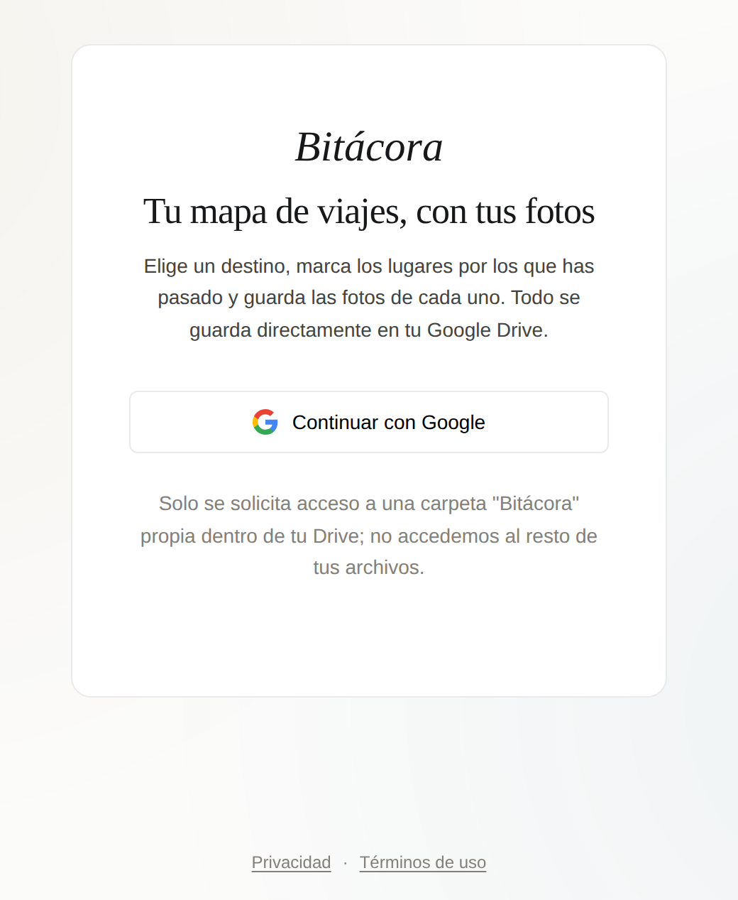

# 🧭 Bitácora

**Tu mapa de viajes, con tus fotos.**

Un diario de viaje visual: eliges un destino, marcas los lugares por los que has pasado
y guardas una foto de cada uno. Todo se guarda directamente en tu propio Google Drive —
nunca en un servidor ajeno.

[**Pruébala →**](https://diegomaartinez.github.io/Bitacora/)

## Qué hace

- 🗺️ **Un mapa por viaje.** Escribe un destino, ve el mapa y marca cada lugar por el que
  has pasado con un clic.
- 📸 **Fotos de cada lugar**, guardadas junto al resto del viaje.
- 🎨 **Colores y fechas** por lugar, para ver el recorrido de tu viaje de un vistazo.
- 🪄 **Genera resúmenes bonitos** para compartir: un post cuadrado tipo Instagram, un
  "billete de avión" con tu destino, o una guía estilo mapa de metro con la ruta que
  seguiste.
- 🔗 **Comparte un viaje** con un enlace: quien lo reciba puede pedir unirse, y tú decides
  si entra como editor o solo puede mirar.
- 🌍 **Español e inglés**, y pensada para usarse bien tanto en el móvil como en el
  ordenador.
- 🔒 **Todo vive en tu Google Drive.** Bitácora no tiene servidor ni base de datos propia:
  solo puede tocar la carpeta que ella misma crea en tu Drive, nunca el resto de tus
  archivos.

## ¿Quieres tu propia instancia?

Bitácora es de código abierto. Si quieres publicar tu propia copia (con tus propias
credenciales de Google), la guía completa paso a paso está en
[`docs/SELF_HOSTING.md`](docs/SELF_HOSTING.md).

## Licencia

[MIT](LICENSE) — úsala, modifícala y compártela con libertad.
